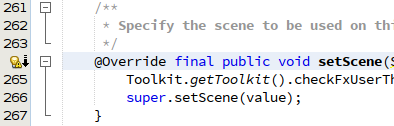
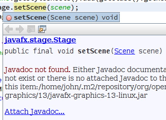

# Attaching JavaFX Javadoc and Sources

## Timeline

* **2019-10-25:** Created this repository and the corresponding NetBeans bug report.
* **2020-01-30:** The [first of these fixes](https://github.com/apache/netbeans/pull/1548) is merged for release in NetBeans 11.3.

## Bug Report

I have been unable to attach the JavaFX Javadoc and Sources to their modular JAR files without encountering errors in their use by NetBeans.
Attaching the Sources allows you to navigate directly to the JavaFX source code of a field or method.
Attaching the Javadoc allows you to open an external Web browser directly to the appropriate page of the documentation.
These features are two of the main reasons I use an integrated development environment.

There are several issues encountered in this task, making it easy to lose sight of the bigger picture.
This is my attempt to provide that more general context and gather all the related issues into one place.

## Issues

Some of the problems related to using the JavaFX Javadoc and Sources have already been reported:

* [NETBEANS-236](https://issues.apache.org/jira/browse/NETBEANS-236): Incorrect brace spacing in try-with-resources
* [NETBEANS-1396](https://issues.apache.org/jira/browse/NETBEANS-1396): Maven: Downloaded javadoc / sources not attached to artifact with classifier
* [NETBEANS-2197](https://issues.apache.org/jira/browse/NETBEANS-2197): Missing code completion and Javadocs in maven projects with classifier
* [NETBEANS-2290](https://issues.apache.org/jira/browse/NETBEANS-2290): nb-javac 1.71 fails to parse JavaFX Sources

The two issues concerning Maven projects will be fixed by the following pull request (a work in progress):

* [apache/netbeans#1548](https://github.com/apache/netbeans/pull/1548): (NETBEANS-1396) Missing code completion and Javadocs in maven projects with classifier

I created the following issues for the new problems described here:

* [NETBEANS-3297](https://issues.apache.org/jira/browse/NETBEANS-3297): "Attach Javadoc" really means "Attach Sources"
* [NETBEANS-3298](https://issues.apache.org/jira/browse/NETBEANS-3298): Invalid Javadoc root javafx-sdk-13/doc/javafx.base
* [NETBEANS-3299](https://issues.apache.org/jira/browse/NETBEANS-3299): Adding Javadoc and Sources to Global Library fails
* [NETBEANS-3300](https://issues.apache.org/jira/browse/NETBEANS-3300): nb-javac 2.0 fails to parse JavaFX Sources
* [NETBEANS-3301](https://issues.apache.org/jira/browse/NETBEANS-3301): Modular Ant project fails to run without nb-javac
* [NETBEANS-3302](https://issues.apache.org/jira/browse/NETBEANS-3302): Non-modular Gradle project fails to recognize Javadoc
* [NETBEANS-3303](https://issues.apache.org/jira/browse/NETBEANS-3303): Modular Gradle project fails to recognize Javadoc and Sources

There are also related issues for the JavaFX Javadoc and sample NetBeans projects on GitHub:

* [openjfx/javadoc#6](https://github.com/openjfx/javadoc/issues/6): Attached Javadoc does not follow Maven convention
* [openjfx/samples#39](https://github.com/openjfx/samples/issues/39): IllegalStateException running NetBeans Modular Maven project

Each issue is listed again at the point where it's encountered below.

## Projects

I use the six sample NetBeans projects described in [Getting Started with JavaFX 13](https://openjfx.io/openjfx-docs/) to explain what goes wrong.
I examine the projects in the following order:

1. Ant ("Java") Non-Modular
1. Ant ("Java") Modular
1. Maven Non-Modular
1. Maven Modular
1. Gradle Non-Modular
1. Gradle Modular

The sample projects are found under the [NetBeans](https://github.com/openjfx/samples/tree/master/IDE/NetBeans) directory of the [openjfx/samples](https://github.com/openjfx/samples) repository on GitHub.
All six projects fail in one way or another to use the attached Javadoc and Sources.
In some cases there are workarounds, but the workarounds often introduce a new set of problems.

## Environment

I am running [Apache NetBeans 11.2](https://snapcraft.io/netbeans) with [OpenJDK 13.0.1](https://jdk.java.net/13/) on [Ubuntu 16.04.6 LTS](http://releases.ubuntu.com/16.04/).
I configured the snap package to track the *edge* channel for an early release of NetBeans 11.2.

### JavaFX SDK

I set up the JavaFX SDK and JMODs on my system as instructed below.
These files are required by the projects using Apache Ant.
Note that the Ant projects define two different names for the JavaFX SDK Global Library: *JAVAFX13* and *JavaFX13*.

Download the [Latest Release](https://gluonhq.com/products/javafx/) of the JavaFX Documentation, JavaFX Linux JMODs, and JavaFX Linux SDK.

```
~/Downloads/openjfx-13-javadoc.zip
~/Downloads/openjfx-13_linux-x64_bin-jmods.zip
~/Downloads/openjfx-13_linux-x64_bin-sdk.zip
```

Extract the JavaFX Linux JMODs and JavaFX Linux SDK into `~/lib` with:

```ShellSession
$ mkdir ~/lib
$ cd ~/lib
$ unzip ~/Downloads/openjfx-13_linux-x64_bin-jmods.zip
$ unzip ~/Downloads/openjfx-13_linux-x64_bin-sdk.zip
```

Extract the JavaFX Sources into `~/lib/javafx-sdk-13/src` with:

```ShellSession
$ cd ~/lib/javafx-sdk-13
$ mkdir src
$ cd src
$ unzip ../lib/src.zip
```

Extract the JavaFX Documentation into `~/lib/javafx-sdk-13/doc` with:

```ShellSession
$ cd ~/lib/javafx-sdk-13
$ unzip ~/Downloads/openjfx-13-javadoc.zip
$ mv openjfx-13-javadoc.zip doc
```

### Command Line

My command-line environment is set up by sourcing the following script, which I named *jdkenv.sh*.
The script sets up the latest versions of the [Apache Ant](https://ant.apache.org/bindownload.cgi) and [Gradle](https://gradle.org/release-candidate/) build tools for use.

**~/bin/jdkenv.sh**
```Shell
#!/bin/bash
# Sets up the environment for JavaFX applications
syspath=/usr/local/sbin:/usr/local/bin:/usr/sbin:/usr/bin:/sbin:/bin

# JavaFX SDK and JMODs
export JAVAFX_SDK=$HOME/lib/javafx-sdk-13/lib
export JAVAFX_JMODS=$HOME/lib/javafx-jmods-13

# JDK and build tools
export JAVA_HOME=$HOME/opt/jdk-13.0.1
export ANT_HOME=$HOME/opt/apache-ant-1.10.7
export GRADLE_HOME=$HOME/opt/gradle-6.0-rc-1
export PATH=$GRADLE_HOME/bin:$ANT_HOME/bin:$JAVA_HOME/bin:$syspath
```

### Platform Javadoc

You might think the Java Platform Javadoc is already attached because you see it in the Javadoc Documentation window and in the code completion, but that information is obtained from the Platform Sources.
NetBeans does not add the correct Javadoc directories when creating a Java Platform, so delete those and add the directories for the specific modules you require as shown below.


To determine that the Javadoc is recognized, check whether you can show the documentation in an external Web browser.
That's possible when the second toolbar button from the right is enabled in the Javadoc Documentation window, as shown below.
As far as I can tell, this is the only feature obtained by attaching the Javadoc.


## Ant Non-Modular

After defining the *JAVAFX13* Global Library as instructed in the [Getting Started](https://openjfx.io/openjfx-docs/) guide, the project builds and runs without errors.
If you open the file *Main.java* and click a JavaFX method name, such as `show()`, the Javadoc Documentation window appears as below.


It's important to note here that NetBeans generates the documentation for the Javadoc window and code completion using the source code, **not the Javadoc**.
This implementation is useful because it allows you to view all of the documentation available in the source code rather than just those methods and fields included in the external Javadoc documentation.

Attaching the Javadoc allows you to open the documentation in an external Web browser by clicking the second toolbar button from the right in the Javadoc Documentation window (disabled in the screenshot above).
The "Javadoc not found" and "Attach Javadoc..." notices sometimes indicate that the Javadoc comments don't exist in the source code and are shown even when the Javadoc is successfully attached.

I created the following issue to resolve the wording.

> [NETBEANS-3297](https://issues.apache.org/jira/browse/NETBEANS-3297): "Attach Javadoc" really means "Attach Sources"

Holding down the *Ctrl* key when clicking the same method shows that the source code is not available.


Neither of these results are a surprise because we have made no attempt to attach the Javadoc and Sources.

### Add to Global Library

The first obvious thing to try is to add the Javadoc and Sources to the JavaFX Global Library.
The following error occurs for each of the Javadoc directories.
Click the *OK* button to dismiss each window.


I created the following issue to track the error, even though the problem may lie in the JavaFX Javadoc packaging.

> [NETBEANS-3298](https://issues.apache.org/jira/browse/NETBEANS-3298): Invalid Javadoc root javafx-sdk-13/doc/javafx.base

With all of the Javadoc and Sources added, the JAVAFX13 Global Library looks like this:


After adding those directories, the method declaration of the Javadoc is visible, but the description and parameters are missing.
The button to show the documentation in an external Web browser is enabled and works as expected.
Navigating to a source method sometimes goes to the correct location and other times goes to the top of the file.
The source code in both cases shows a file full of parsing errors.


I created the following issue for these errors.

> [NETBEANS-3299](https://issues.apache.org/jira/browse/NETBEANS-3299): Adding Javadoc and Sources to Global Library fails

### Add to JAR files

Instead of adding the entire JavaFX library, let's add only the modular JAR files required by the project to its Compile Classpath.


Add the appropriate Javadoc and Sources directories to the JAR files by selecting each one and clicking the *Edit* button.


After editing each item, you should see badges for the Javadoc and Sources appear on its icon in the Compile Classpath list.

**Important:** Before continuing, remove the Javadoc and Sources from the JavaFX Global Library.
Otherwise, NetBeans continues to pick them up and doesn't notice the changes to the Compile Classpath.

After those changes, the project still builds and runs without errors.
Restart NetBeans so that it parses the JavaFX sources with the new settings.
Now the full Javadoc view and source navigation are working.


Each time you navigate to the source, though, an *Error* notification appears in the lower right corner of the NetBeans window.
Opening the Notification Window shows the following error.


These errors are essentially the same as those reported by the following NetBeans issue.

> [NETBEANS-2290](https://issues.apache.org/jira/browse/NETBEANS-2290): nb-javac 1.71 fails to parse JavaFX Sources

The difference is that NETBEANS-2290 reports the errors of *nb-javac* version 1.71 when parsing the JavaFX source code, while the more recent *nb-javac* 2.0 encounters the errors described here.
I created the following issue for these new errors.

> [NETBEANS-3300](https://issues.apache.org/jira/browse/NETBEANS-3300): nb-javac 2.0 fails to parse JavaFX Sources

### Uninstall *nb-javac*

Next, let's uninstall *nb-javac* to see whether the Java compiler in JDK 13 encounters the same errors.
Note that you must actually **uninstall** the plug-in.
Deactivating it does not prevent its use.
Uninstall the plug-in with the title, "The nb-javac java editing support library," and restart NetBeans.

Now the Javadoc and Sources are working perfectly.




We can ignore the *Info* notification recommending that we install the *nb-javac* plug-in.


There are only two new problems.
The first is a minor formatting error reported by the following issue.

> [NETBEANS-236](https://issues.apache.org/jira/browse/NETBEANS-236): Incorrect brace spacing in try-with-resources

There is an extra space added after the first parenthesis when reformatting a *try-with-resources* statement, as shown in the screenshot below.


The second problem is that the Modular version of this project, discussed next, no longer runs.
That project runs only when *nb-javac* is installed.

Despite those two problems, adding the individual JAR files to the Classpath, along with their Javadoc and Sources directories, and uninstalling *nb-java*, is a good solution as long as the following are true:

* the project is not modular or is a modular library rather than an application, and
* you don't mind an extra space in *try-with-resources* statements when formatting the source.

## Ant Modular

When opening the Modular Ant project, you are notified to create the *JavaFX13* and *JavaFXMODS13* Global Libraries.
Delete the previous *JAVAFX13* Global Library and create these two new libraries as instructed in the [Getting Started](https://openjfx.io/openjfx-docs/) guide.


Leave the *nb-javac* plug-in uninstalled, and do not attach the Sources or Javadoc yet.
The project builds without errors, but it fails to run.
The following notification appears when clicking the *Run Project* button in the NetBeans toolbar.


I created the following issue for the error.

> [NETBEANS-3301](https://issues.apache.org/jira/browse/NETBEANS-3301): Modular Ant project fails to run without nb-javac

The Javadoc is not found because neither the Javadoc nor Sources are attached, but clicking through to the Sources fails to open even the *Compiled Code* view.

Putting aside for a moment the run failure, let's try to get the Javadoc and Sources working using the same technique as before.
Attach the individual JAR files instead of the entire JavaFX library.
Because this is a Modular project, add the JAR files to the Compile Modulepath instead of the Compile Classpath.
Edit each JAR file to add the appropriate Javadoc and Sources directories.
After those changes, the Modulepath looks like the screenshot below, with badges for the Javadoc and Sources on each icon in the list.


The project still fails to run, but now the Javadoc window, code completion, and source navigation all work as expected.

To solve the problem with *Run Project*, let's install the *nb-javac* plug-in and see whether we can still use the Javadoc and Sources.
After installing the plug-in, the project now builds and runs without errors.
Better yet, even the Javadoc is displayed in the window and in the code completion.
But each time we navigate to the Sources, we get the same exception as before.


I created the following issue for the error.

> [NETBEANS-3300](https://issues.apache.org/jira/browse/NETBEANS-3300): nb-javac 2.0 fails to parse JavaFX Sources

We can try one more thing: uninstall the *nb-javac* plug-in again and run the project from the command line.
The environment variables are defined in the shell script *~/bin/jdkenv.sh*, listed previously.

```ShellSession
$ source ~/bin/jdkenv.sh
$ ant run
...
BUILD SUCCESSFUL
Total time: 4 seconds
```

The project runs without problems from the command line.
So this seems like a good solution: attach the JAR files individually along with their Javadoc and Sources directories, uninstall the *nb-javac* plug-in, and run the project from the command line instead of from NetBeans.

## Maven Non-Modular

Reinstall the *nb-javac* plug-in so we're starting again with the normal configuration.

There are several problems when using the JavaFX Javadoc and Sources in a Maven project, summarized in the GitHub pull request below.

> [apache/netbeans#1548](https://github.com/apache/netbeans/pull/1548): (NETBEANS-1396) Missing code completion and Javadocs in maven projects with classifier

To work around the problems, create the correctly-named artifacts manually in your local Maven cache by following the links in the pull request.
You should end up with the following files under the directory `~/.m2/repository/org/openjfx/`, along with their corresponding `.sha1` checksum files.

**~/.m2/repository/org/openjfx/**
```
javafx-base/13/javafx-base-13-linux.jar
javafx-base/13/javafx-base-13-linux-javadoc.jar
javafx-base/13/javafx-base-13-linux-sources.jar
javafx-controls/13/javafx-controls-13-linux.jar
javafx-controls/13/javafx-controls-13-linux-javadoc.jar
javafx-controls/13/javafx-controls-13-linux-sources.jar
javafx-fxml/13/javafx-fxml-13-linux.jar
javafx-fxml/13/javafx-fxml-13-linux-javadoc.jar
javafx-fxml/13/javafx-fxml-13-linux-sources.jar
javafx-graphics/13/javafx-graphics-13-linux.jar
javafx-graphics/13/javafx-graphics-13-linux-javadoc.jar
javafx-graphics/13/javafx-graphics-13-linux-sources.jar
```

After setting up those files, you should see badges for the Javadoc and Sources on the icons of the project dependencies as shown below.


Even with these work-around techniques, though, the Javadoc fails to display for all methods.
For example, in *App.java* clicking on the `load()` method shows the documentation in the Javadoc window, but not for the `show()` or `setScene(scene)` methods.
The source navigation works for some methods, but other methods just open to the top of the file instead of to their declaration.




Even after uninstalling *nb-javac*, the same types of errors occur.
There doesn't seem to be a work-around.

The following issues address some of these problems.
I'll wait until these are resolved before opening any new issues.

> [NETBEANS-1396](https://issues.apache.org/jira/browse/NETBEANS-1396): Maven: Downloaded javadoc / sources not attached to artifact with classifier

> [NETBEANS-2197](https://issues.apache.org/jira/browse/NETBEANS-2197): Missing code completion and Javadocs in maven projects with classifier

## Maven Modular

After installing the plug-in again, try the Modular Maven project.
The project builds without errors, but it fails to run because of the following error.

> [openjfx/samples#39](https://github.com/openjfx/samples/issues/39): IllegalStateException running NetBeans Modular Maven project

Apply the simple fix in the associated pull request:

> [openjfx/samples#40](https://github.com/openjfx/samples/pull/40): Fix package names of FXML resources and open code

After the fix, the project runs without errors.
We still get the same mixed results as the Non-Modular project, though, and uninstalling the *nb-javac* plug-in again doesn't help this time, either.

The following issues address some of these problems.
I'll wait until these are resolved before opening any new issues.

> [NETBEANS-1396](https://issues.apache.org/jira/browse/NETBEANS-1396): Maven: Downloaded javadoc / sources not attached to artifact with classifier

> [NETBEANS-2197](https://issues.apache.org/jira/browse/NETBEANS-2197): Missing code completion and Javadocs in maven projects with classifier

## Gradle Non-Modular

As of October 2019, there is no Gradle release that works with JDK 13.
Install the [Gradle 6.0 RC1](https://gradle.org/release-candidate/) release candidate to get a version that works.
Set the Java Gradle Options to use this custom Gradle distribution instead of a Standard Gradle Version.


Make sure to **uncheck** the item that says, "Prefer to use Gradle Wrapper that Comes with the Project."
The JavaFX sample projects have a wrapper for Gradle version 5.0, but that version does not work with JDK 13.

We need to do the same trick with Gradle as we did with Maven: copy the Javadoc and Sources to their platform-specific names.
First, though, we need to make Gradle download them.
In a Gradle project, we can't just right-click the Dependencies and select "Download Javadoc" and "Download Sources" as we can with Maven.
Instead, make them *compileOnly* dependencies in the Gradle build file.

**build.gradle**
```Gradle
dependencies {
    compileOnly "org.openjfx:javafx-base:13:sources"
    compileOnly "org.openjfx:javafx-controls:13:sources"
    compileOnly "org.openjfx:javafx-fxml:13:sources"
    compileOnly "org.openjfx:javafx-graphics:13:sources"

    compileOnly "org.openjfx:javafx-base:13:javadoc"
    compileOnly "org.openjfx:javafx-controls:13:javadoc"
    compileOnly "org.openjfx:javafx-fxml:13:javadoc"
    compileOnly "org.openjfx:javafx-graphics:13:javadoc"
}
```

After that change, the files are downloaded to the Gradle cache, and we can copy the Javadoc and Sources to their platform-specific names until we have all of the following files set up under the directory `~/.gradle/caches/modules-2/files-2.1/org.openjfx/`.
The ellipses (`...`) omit the bulk of the checksum directory names for brevity.

**~/.gradle/caches/modules-2/files-2.1/org.openjfx/**
```
javafx-base/13/828b...f4d2/javafx-base-13-linux.jar
javafx-base/13/f063...5023/javafx-base-13-linux-javadoc.jar
javafx-base/13/8eb0...827c/javafx-base-13-linux-sources.jar
javafx-controls/13/bced...34f3/javafx-controls-13-linux.jar
javafx-controls/13/9680...ae7a/javafx-controls-13-linux-javadoc.jar
javafx-controls/13/a297...79f6/javafx-controls-13-linux-sources.jar
javafx-fxml/13/2c10...3bd5/javafx-fxml-13-linux.jar
javafx-fxml/13/ae6a...450a/javafx-fxml-13-linux-javadoc.jar
javafx-fxml/13/8cdc...4850/javafx-fxml-13-linux-sources.jar
javafx-graphics/13/d853...fdfd/javafx-graphics-13-linux.jar
javafx-graphics/13/9dd8...b334/javafx-graphics-13-linux-javadoc.jar
javafx-graphics/13/d407...4b47/javafx-graphics-13-linux-sources.jar
```

The files with the suffixes `-linux-javadoc.jar` and `-linux-sources.jar` are copies of the versions without the platform name that were downloaded by Gradle, as you can see for the JavaFX Base module below.

```
javafx-base/13/8eb0...827c/javafx-base-13-sources.jar
javafx-base/13/8eb0...827c/javafx-base-13-linux-sources.jar
```

```
javafx-base/13/f063...5023/javafx-base-13-javadoc.jar
javafx-base/13/f063...5023/javafx-base-13-linux-javadoc.jar
```

After those changes, both the display of the Javadoc documentation and the source navigation work fine.


NetBeans fails to recognize the Javadoc JAR files, though.
The toolbar button to view the documentation in an external Web browser (second from right) is disabled, as shown below.
The behavior is the same after uninstalling the *nb-javac* plug-in.


I created the following issue to track the error, even though the problem may lie in the JavaFX Javadoc packaging.

> [NETBEANS-3302](https://issues.apache.org/jira/browse/NETBEANS-3302): Non-modular Gradle project fails to recognize Javadoc

## Gradle Modular

To keep the projects synchronized, make the same changes to the *build.gradle* file for the Modular Gradle project as in the previous Non-Modular version, adding the *compileOnly* dependencies for the Javadoc and Sources.
The Gradle cache is already set up with the correct artifact names from the previous section.

The project builds and runs without errors, but the use of the Javadoc and Sources fails completely.
The source completion displays the error shown below, and navigating to the source of a method does nothing at all.
The behavior is the same after uninstalling the *nb-javac* plug-in.


I created the following issue for these errors.

> [NETBEANS-3303](https://issues.apache.org/jira/browse/NETBEANS-3303): Modular Gradle project fails to recognize Javadoc and Sources
