# Apache NetBeans & IntelliJ IDEA

To figure out how this is supposed to work, I compared the use of the Javadoc and Sources by Apache NetBeans and IntelliJ IDEA when they both appear to be working.
For simplicity, I used the [JavaFX samples](https://github.com/openjfx/samples) under the *Non-Modular/Java* directories for each IDE.
I worked around the NetBeans problems by listing the individual JAR files in the Compile Classpath as explained in [NETBEANS-3296](https://issues.apache.org/jira/browse/NETBEANS-3296).

## Public method

In both IDEs I opened *Main.java* and selected the method `setTitle`, which actually has no Javadoc comments in the source code.

```Java
    /**
     * Defines the title of the {@code Stage}.
     *
     * @defaultValue empty string
     */
    private StringProperty title;

    public final void setTitle(String value) {
        titleProperty().set(value);
    }

    public final String getTitle() {
        return title == null ? null : title.get();
    }
```

### Javadoc and Sources

When the Javadoc and Sources are attached, NetBeans enables both toolbar buttons to (1) show the documentation in an external Web browser and (2) open the source in the editor.
IntelliJ IDEA does the same, with a toolbar button to edit the source (not shown below) and a link to open the documentation externally.

| 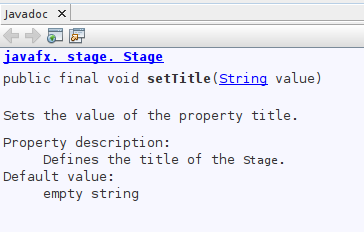 | 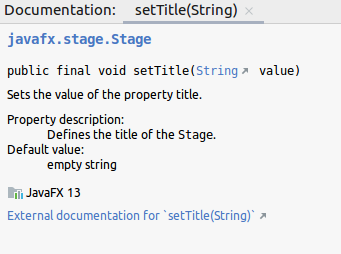 |
|:---------------:|:-------------:|
| Apache NetBeans | IntelliJ IDEA |

### Javadoc only

When only the Javadoc is available, without the Sources, NetBeans disables the toolbar button to open the source in the editor.
*Ctrl-clicking* the method name takes you to the Compiled Code view of the source.
IntelliJ IDEA does something similar, displaying a *Decompiled.class* view of the sources.
Both IDEs display the Javadoc in full with the ability to open the page externally.

| 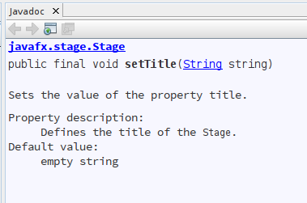 | 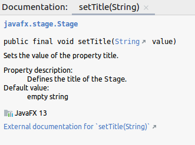 |
|:---------------:|:-------------:|
| Apache NetBeans | IntelliJ IDEA |

### Sources only

When only the Sources are available, without the Javadoc, NetBeans finds no Javadoc comments in the source code and displays an error.
IntelliJ IDEA shows only the method signature and modifiers.
Both IDEs disable the options to show the documentation externally.

| 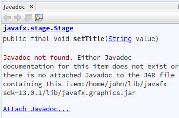 | 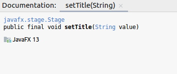 |
|:---------------:|:-------------:|
| Apache NetBeans | IntelliJ IDEA |

### Neither Javadoc nor Sources

When neither are present, NetBeans displays an error and IntelliJ IDEA shows just the method signature and modifiers.
Navigating to the source shows the Compiled Code view in NetBeans and the *Decompiled.class* view in IntelliJ IDEA.
There is no option to show the documentation externally.

| 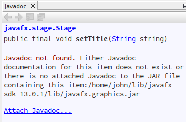 | 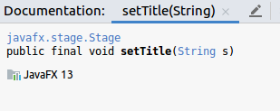 |
|:---------------:|:-------------:|
| Apache NetBeans | IntelliJ IDEA |

### Precedence

To discover which takes precedence, the Javadoc or the Sources, I modified the *Stage.java* source code as follows.

```Java
    /**
     * Sets the title of the {@code Stage}. Note that this Javadoc comment is
     * different than the text published in the Javadoc HTML for this method.
     *
     * @param value the string to set as the {@code Stage} title
     */
    public final void setTitle(String value) {
        titleProperty().set(value);
    }
```

The result below shows that NetBeans displays the Javadoc comments in the source code over anything in the Javadoc HTML, while IntelliJ IDEA gives priority to the Javadoc HTML over the source comments.

Furthermore, IntelliJ IDEA shows the Javadoc HTML text even when you navigate to the source code and select the `setTitle` method where it is defined.
The only way to make IntelliJ IDEA show the Javadoc comments in the source code is to remove the Javadoc directories from the JavaFX Global Library.

| 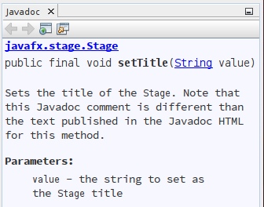 | 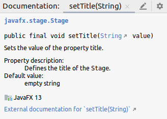 |
|:---------------:|:-------------:|
| Apache NetBeans | IntelliJ IDEA |

## Non-public method

To see what the IDEs do for a method that has Javadoc comments but is not published in the documentation, I opened *Stage.java* by navigating from the method `setTitle` above and selected the method `initSecurityDialog`, whose source code is listed below.

```Java
    /**
     * Sets a flag indicating that this stage is used for a security dialog and
     * must always be on top. If set, this will cause the window to be always
     * on top, regardless of the setting of the alwaysOnTop property, and
     * whether or not permissions are granted when the dialog is shown.
     * NOTE: this flag must be set prior to showing the stage the first time.
     *
     * @param securityDialog flag indicating that this Stage is being used to
     * show a security dialog that should be always-on-top
     *
     * @throws IllegalStateException if this property is set after the stage
     * has ever been made visible.
     *
     * @defaultValue false
     */
    final void initSecurityDialog(boolean securityDialog) {
        if (hasBeenVisible) {
            throw new IllegalStateException("Cannot set securityDialog once stage has been set visible");
        }

        this.securityDialog = securityDialog;
    }
```

In this case, both IDEs display the Javadoc from the source code.
They both attempt to show the documentation in an external Web browser at `Stage.html#initSecurityDialog(boolean)`, but that anchor location does not exist, so the browser opens to the top of the page.

| 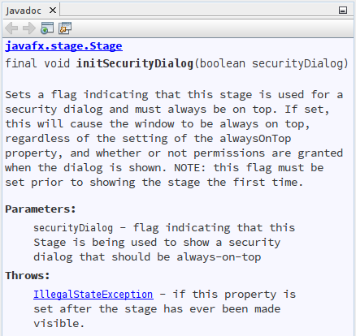 | 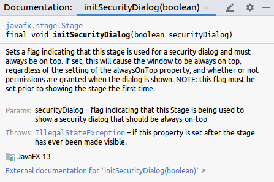 |
|:---------------:|:-------------:|
| Apache NetBeans | IntelliJ IDEA |

## JavaFX library

The JavaFX library was defined in NetBeans and IntelliJ IDEA with the Javadoc and Sources as shown below.

| 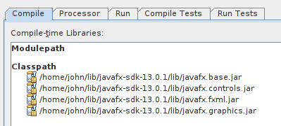 | 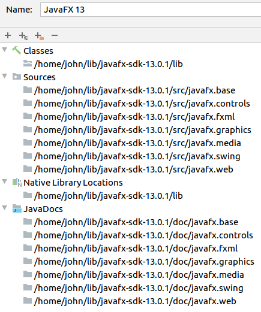 |
|:---------------:|:-------------:|
| Apache NetBeans | IntelliJ IDEA |
